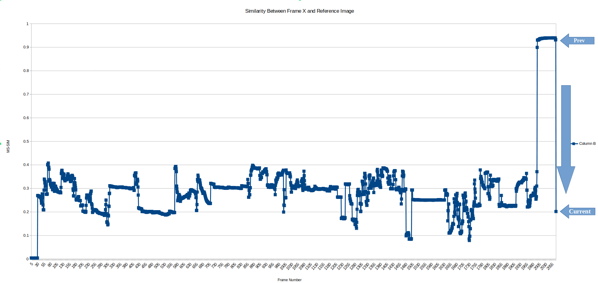

+++
title = "Automatic TV Show Intro Detection"
date = "2025-07-23"
tags = ["python", "computer-vision"]
draft = false
+++

# TLDR

Using MS-SSIM ([Multi Scale Strucutural Similarity](https://en.wikipedia.org/wiki/Structural_similarity_index_measure "_blank")) to calculate the similarity between a known frame and the last frame of an intro in DBZ Kai allowed me to figure out where the intro sequence was in a subset of the pre Boo Saga DBZ Kai episodes. 

The Single-Core performance operates at about 33 fps and using 4 cores to parallelize the process provides a small increase in performance to 52 fps

Using a visual based process to find intro's seems to be unreliable with a series that has multiple different visuals while maintaining, more or less, the same audio track.

# Motivation 

Recently, I was watching Dragon Ball Z Kai and noticed that the intro song, Dragon Soul, had several different singers throughout various parts of the show. I didn't recall this and only remember one specific singer, Vic Mignogna. Since I already had all the episodes downloaded, I was thinking about replacing the audio track of the intro from each episode with the audio track which had Vic singing the theme song.

To do this, I'll use ffmpeg to perform the actual audio replacement, but I need to specify the start of the intro for each episode. Not all episodes start rolling the intro at the same time so I'll need to detect the intro for each episode on its own.

# Methodology

The basic concept for both methods I used for intro detection is having a frame from the video from either the very beginning of the intro or the very end and then going through each frame in each episode and computing the similarity of the reference frame to each frame in the episode. I'll be using MS-SSIM ([Multi Scale Strucutural Similarity](https://en.wikipedia.org/wiki/Structural_similarity_index_measure "_blank")) to calculate frame similarity. When there is a sufficiently high level of similarity, that's a tell that the the program has found a match, and we can use the index of the matched frame and the FPS to calculate the timestamp where the match happens.

## First Frame Based Intro Detection

For this method, the first frame of the intro is detected. For specifically the DBZ Kai Pre Boo Saga episodes this method poses a slight problem. The first frame of the intro is completely black, there is about a second or two of just black frames with no audio that then evolved into the first visual frame. So instead, I used the first frame that wasn't just black to calculate the start and end position. Because there is a slight offset, the audio was not completely in sync. 

## Last Frame Based Intro Detection

For this method the program will loop through the frames until there's a large drop-off in frame similarity. The idea is that for some frames at the end of the intro, there will be very high similarity between the reference frame and the frame the program is currently on. The frame directly after is probably not going to be similar at all to the end of the intro so there will be a steep drop-off of similarity. Using this drop-off we can figure out when the intro starts and ends more reliably.

[Click here for full res MS-SSIM Dropoff](ssim-dropoff.png "_blank")

# High-Level Implementation

## First Frame Based Intro Detection

A pretty simple process. 

1. Read a frame from the cv2 Video Capture, reshape it if necessary. 
2. Calculate the MS-SSIM score. Add that score to a list of scores. 
3. If the current score is greater than `0.8`, we've found the intro.
4. Using the FPS, I can calculate the timestamp in seconds and then turn that into a MM:SS time for the first frame of the 

## Last Frame Based Intro Detection

Pretty similar to the First Frame based process except step 3 would be:

3. If the difference between the previous and current score is greater than `0.5`, we've found the last frame of the intro.

## A Very Naive Multi Core Version of Last Frame Based Intro Detection

In this implementation I'm using the `multiprocessing` library to make use of multiple cores (4), and some data structures to share data.
I'm operating in batches of `1000` frames. 

### Main Process:
1. Loop Forever
2. Read `1000` frames
3. Convert each to grayscale 
4. Push the index of the frame and frame data into a queue
5. Launch the cores 
6. Loop over the calculated scores and see if the `previous - current` score is greater than `0.5`

### Consumer Processes:
1. Read an index and frame from queue as long as there are values to be read
2. Calculate MS-SSIM score and put it into shared array at the index that was popped off the queue
3. End once there are no more frames to be read

# Performance 

Each implementation was tested on `S01E38` of `Dragon Ball Z Kai` so that the intro was offset into the video a little bit to get a better idea of the first and last frame implementations

## Specs of Machine
- CPU: `AMD Ryzen 7 5800X3D`
- RAM: 32 GB

## Video Specs


Resolution|1440x1080
Encoding|h264 (High)
Colorspace|yuv420p (progressive)
FPS|23.98
Bits Per Second?|4907332 -> 613.4


#### These are very naive implementations that are not optimized and there is for sure performance left on the table.

## First Frame Based Intro Detection


Time Of Intro|00:26
Frame|624
Runtime|39s
FPS|16


I noticed that this FPS seems fairly low, It's because I realized the reference frame I was using had a resolution of `1440x1080`. Let's see what the performance looks like when the reference image is `960x720`, just as it is for the Last Frame based implementations.


Time Of Intro|00:26
Frame|624
Runtime|19s
FPS|32.8


Shrinking the images that ssim operates on clearly shows an improvement in performance. 


Runtime|51%|Decrease
FPS|105%|Increase


## Last Frame Based Intro Detection


Time Of Intro|1:51
Frame|2664
Runtime|1:22
FPS|32.5


## Naive Multi Core Implementation


Time Of Intro|1:51
Frame|2664
Runtime|51s
FPS|52.2
FPS/Core|13
Cores|4


# Limitations

## Accuracy

The first frame based method at the moment is not entirely accurate. Because the DBZ Kai intro first has around a second of black frames before starting the intro, when I was replacing the audio track, the audio didn't sync up. Realistically, this could probably be solved by offsetting the calculated frame with the number of frames that there is a black frame on screen. This seems a bit simplistic and I imagine there could be some potential problems with this method which is what led me to use the last frame-based method.

## Methodology

While testing on a few episodes I realized that my script was failing on S01E64. Upon further inspection I saw that the last frame of the was not the same as S01E1 and S01E38. This means that this method would only work on a subset of episodes which means I should find a better method of recognizing the end of an intro based on something other than just frame similarity. Maybe something based on audio would be a better method.

## Multi Core 

My multi core implementation is very very bad. I get a marginally better time overall but per core the rate decreases by a lot. I'm not very familiar with using multiprocessing so mostly this is a skill issue. I imagine the multiprocessing queue has some sort of synchronization/built-in locking so that could potentially be holding back some performance. For next steps I want to be able to use a lock free method for grabbing frames and storing scores. 
